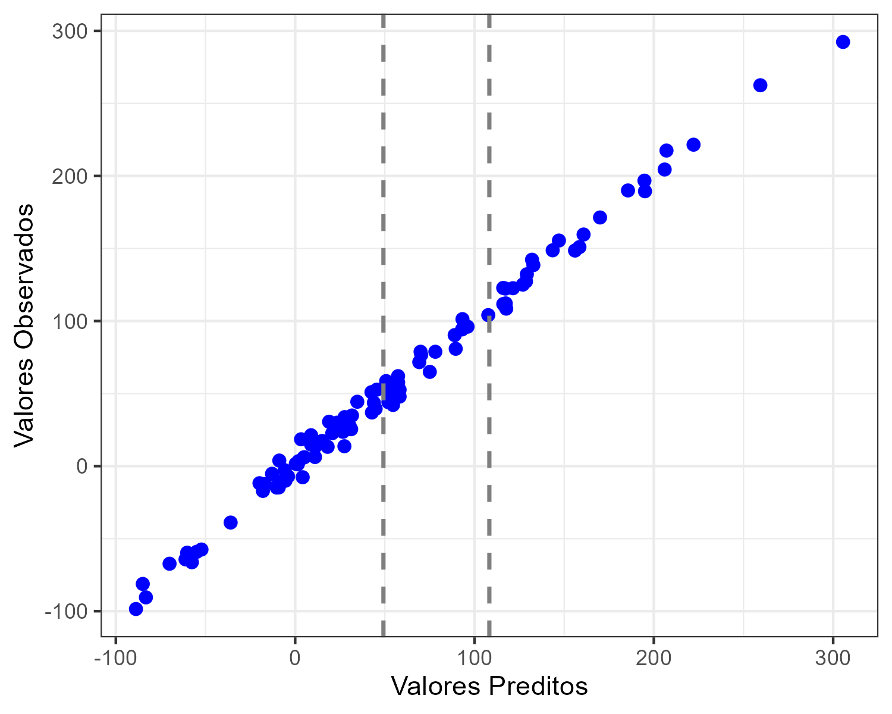

# trab2me918

## Introdução

O pacote em R `trab2me918` tem o objetivo de realizar o ajuste de uma
regressão linear, gerando objetos úteis para a sua análise, como os
valores dos coeficientes ajustados, resíduos, valores preditos, entre
outros. Possui as seguintes funções:

- `banco_exemplo`: contém um banco de dados simulados.
- `ajusta_beta`: calcula os valores dos coeficientes (betas) de uma
  regressão linear com variáveis preditoras numéricas.
- `predicao`: faz predições em um modelo linear para um conjunto de
  dados.
- `grafico_pred`: plota gráfico de valores preditos vs. valores
  obervados.

## Instalação

O `trab2me918` será mantido apenas no Github. Para utilizar o pacote
corretamente, é necessário que o usuário tenha linguagem de programação
R na versão 2.10 ou superior. A instalação pode ser feita por meio da
função abaixo:

``` r
# install.packages("devtools")
devtools::install_github("jsicas/trab2me918")
```

### banco_exemplo

Consiste em um banco de dados simulados com 4 variáveis e 100
observações. É um objeto `data.frame` contendo 3 preditores ($X1$, $X2$
e $X3$) e uma variável resposta ($Y$).

As variáveis foram geradas da seguinte forma:

$$
\begin{aligned}
X1 &\sim \mathcal{N}(6, 18^2)\\
X2 &\sim \mathcal{N}(10, 30^2)\\
X3 &\sim Exp(5)\\
Y &= \frac{2}{3} X1 + \frac{5}{2} X2 + X3 + \varepsilon, \;\;\varepsilon \sim \mathcal{N}(0, 7^2)
\end{aligned}
$$

### ajusta_beta

Função que calcula os valores dos coeficientes (betas) de uma regressão
linear com variáveis preditoras numéricas. Possui os seguintes
argumentos:

- `formula`: recebe a fórmula que será utilizada no ajuste do modelo.
  Deve ser escrita da seguinte maneira:
  `Variável Resposta ~ Variáveis Preditoras`.
- `data`: um objeto contendo o banco de dados que será utilizado no
  ajuste.

### predicao

Função que faz predições em um modelo linear para um conjunto de dados.
Possui os seguintes argumentos:

- `model`: objeto de modelo da classe `modelo_linear` cuja predição é
  desejada.
- `new_data`: conjunto de preditoras desejado. Deve ser um data frame,
  cujas colunas têm os nomes das preditoras (deve possuir todas).

### grafico_pred

Função que plota gráfico de valores preditos vs. valores obervados.
Possui os seguintes argumentos:

- `model`: objeto de modelo da classe `modelo_linear` cuja predição é
  desejada.
- `new_data`: argumento opcional com conjunto de preditoras para usar no
  gráfico. 
- `file`: argumento opcional com o caminho de onde se quer salvar o
  gráfico.
- `width`: argumento opcional com a largura do gráfico em polegadas.
- `height`: argumento opcional com a altura do gráfico em polegadas.

## Exemplo

Podemos fazer a regressão linear múltipla utilizando o `banco_exemplo`
disponibilizado no pacote.

``` r
library(trab2me918)
data("banco_exemplo")
head(banco_exemplo) #Primeiras seis observações
```

    ##           X1        X2         X3          Y
    ## 1  -8.525470 -4.017784 3.21337366  -5.284408
    ## 2 -15.536322 -3.521253 3.15884769 -12.411591
    ## 3   7.884230 17.638062 0.07129624  58.608833
    ## 4  25.274326 73.224618 2.26803371 204.456216
    ## 5  -5.284394  6.601344 5.07648243  13.292769
    ## 6 -30.981479  9.059686 4.22911778   5.956874

``` r
modelo <- ajusta_beta(formula = Y ~ X1 + X2 + X3, data = banco_exemplo)
modelo
```

    ## Modelo de Regressão Linear Ajustado:
    ## Fórmula: Y ~ X1 + X2 + X3 
    ## 
    ## Coeficientes:
    ##                  betas
    ## (intercepto) 0.3573979
    ## X1           0.7277274
    ## X2           2.5278189
    ## X3           0.9660957
    ## 
    ## Valores Preditos:
    ##           [,1]
    ## [1,] -12.89862
    ## [2,] -16.79815
    ## [3,]  50.74967
    ## [4,] 206.03993
    ## [5,]  18.10317
    ## 
    ## Resíduos:
    ##           [,1]
    ## [1,]  7.614216
    ## [2,]  4.386558
    ## [3,]  7.859160
    ## [4,] -1.583714
    ## [5,] -4.810402

``` r
predicao(model = modelo, new_data = data.frame(X1 = c(3, 10), X2 = c(7, 23), X3 = c(30, 44)))
```

    ##       betas
    ## 1  49.21818
    ## 2 108.28272

``` r
grafico_pred(model = modelo, new_data = data.frame(X1 = c(3, 10), X2 = c(7, 23), X3 = c(30, 44)), file = "exemplo.png", width = 5, height = 4, device = 'png')
```

<!-- -->
